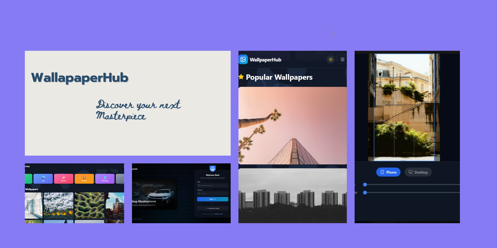

# 🌟 WallpaperHub

**WallpaperHub** is a premium, progressive web application (PWA) that allows users to discover, customize, and download high-resolution 4K wallpapers. It features a built-in image editor, secure authentication, and a cinematic UI.

 
## 🚀 Live Demo
[Insert Your Vercel/Netlify Link Here]([https://your-app-url.vercel.app](https://wallpaper-app-phi.vercel.app/))

---

## ✨ Features

### 🎨 **Interactive Image Editor**
- **Built-in Studio:** Customize wallpapers before downloading.
- **Crop & Resize:** Presets for Phone (9:16) and Desktop (16:9).
- **Filters:** Adjust Blur and Zoom levels for the perfect home screen look.
- **Pure Client-Side:** Image processing happens instantly in the browser using HTML5 Canvas.

### 🔐 **Smart Authentication**
- **Firebase Integration:** Secure Google & Email login.
- **Guest Mode:** Browse freely; sign in to unlock premium features like "Save to Favorites."
- **Private Favorites:** Each user has their own persistent list of liked wallpapers.

### 📱 **Progressive Web App (PWA)**
- **Installable:** Works like a native app on iOS and Android.
- **Offline Capable:** Caches assets for faster loading.
- **App Icon:** Custom generated icons for a professional home screen presence.

### ⚡ **Modern Tech Stack**
- **Cinematic UI:** Glassmorphism, smooth transitions, and masonry grids.
- **Smart Downloads:** Direct "Blob" downloads that bypass "Open in New Tab" issues.
- **Dark Mode:** Fully responsive dark/light themes.

---

## 🛠️ Tech Stack

- **Frontend:** React (Vite)
- **Styling:** Tailwind CSS
- **Icons:** Lucide React
- **Auth:** Firebase Authentication (v10)
- **API:** Unsplash API
- **Image Processing:** React-Easy-Crop + HTML5 Canvas
- **PWA:** Vite-Plugin-PWA

---

## 📸 Screenshots

| Home Page | Image Editor | Mobile View |
|:---:|:---:|:---:|
|  |  |  |

---

## 🚀 Getting Started

Follow these steps to run the project locally.

### 1. Clone the Repo
```bash
git clone [https://github.com/P01Sensai/wallpaper-app.git](https://github.com/P01Sensai/wallpaper-app.git)
cd wallpaper-app
